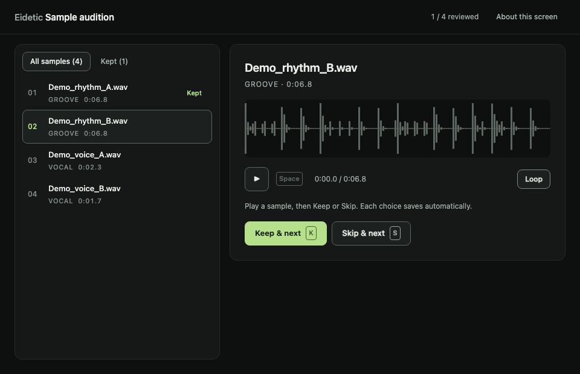
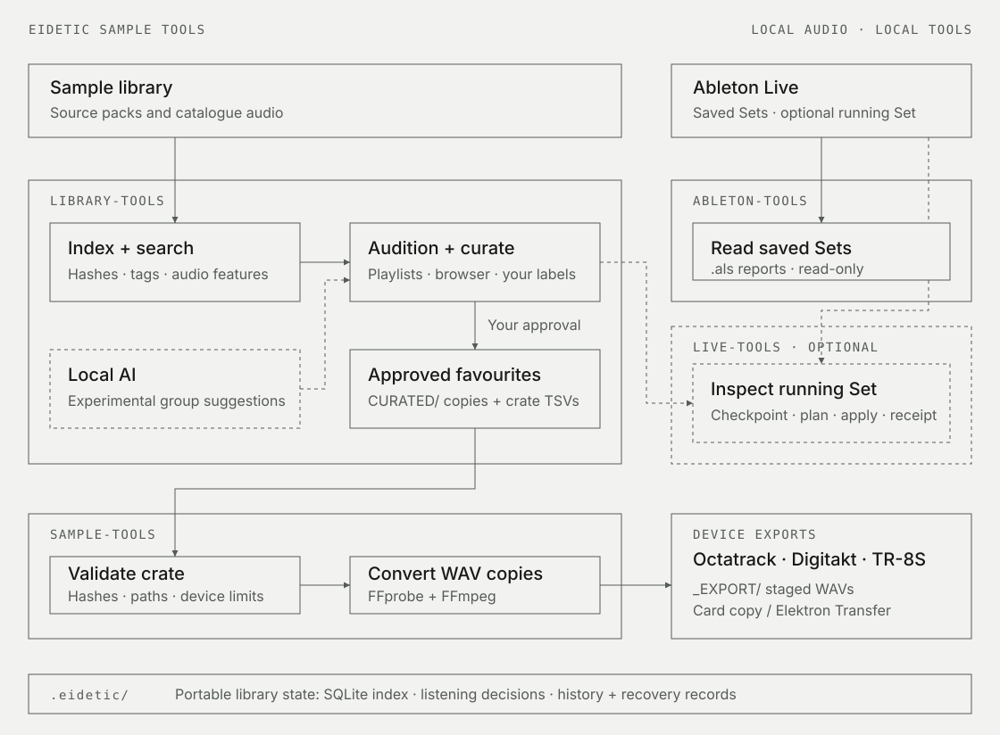

# Eidetic Sample Tools

**Turn your sample library into sounds you want to play.**

Find and audition samples, keep the ones that work, and prepare collections for
**Octatrack MKII, Digitakt MKI and TR-8S**. Built for electronic musicians working
with large sample folders and hardware samplers. Includes tools for exploring
saved Ableton Live projects without opening Live.

[](https://github.com/you1anna/eidetic-sample-tools/actions/workflows/tests.yml)

[Get started](docs/GETTING-STARTED.md) · [User guides](docs/README.md) ·
[Architecture](docs/TECHNOLOGY.md) · [Roadmap](docs/ROADMAP.md)

## What it helps you do

- **Find useful sounds faster.** Search musical tags and pack origins, or find
  sounds with similar acoustic characteristics to a sample you already like.
- **Choose by ear.** Listen in a browser, keep or skip candidates, and resume
  later. Local AI can suggest listening groups; you approve the favourites.
- **Explore beyond familiar picks.** Save candidate selections, retain chosen
  sounds and control repeats using supplied export history for each device.
- **Spend less time preparing files.** Preview a collection, create compatible
  WAV copies with short names, and reuse previously verified conversions.

## Listen before you export



*The working audition interface with explicitly supplied, synthetic demonstration
files.* [Follow the listening workflow](docs/WORKFLOWS.md#3-curate-by-ear).

## Start with your own library

Use the [installation and first-search guide](docs/GETTING-STARTED.md) for
macOS or Linux with Python 3.12. These are command-line tools with a browser
interface for listening; installation is currently from this repository.

After setup, this command summarises sample folders inside your library without
writing files. See the [folder example](docs/GETTING-STARTED.md#inspect-a-folder):

```bash
sample-review --root /path/to/SAMPLES --no-probe --summary
```

Continue to [search and listening](docs/GETTING-STARTED.md#search-and-listen),
then [approve and export a collection](docs/WORKFLOWS.md#3-curate-by-ear).
Curation and export create copies; organisation lets you preview moves and keep
undo records. See the [safety guide](docs/SAFETY.md) before changing a library.

## Choose the tools you need

| Tool | Use it to… |
|---|---|
| [Library tools](library-tools/README.md) | Find, audition and collect sounds; organise packs and exact duplicates. |
| [Sample export](sample-tools/README.md) | Prepare selected collections for your sampler and supported card transfers. |
| [Ableton tools](ableton-tools/README.md) | Rediscover saved projects and check their sample references. |

Each package can be installed independently.

## What's ready

Inspection, organisation and conversion are established; search and curation are
beta. Collection planning, browser audition and local AI grouping are experimental.
A [guided trial](docs/SET-GENERATION-TRIAL.md) produced 19 approved, software-verified
Octatrack exports from 24 auditions; that export's hardware check remains pending.

Local AI is central to the planned musical-brief workflow. Whole-library AI
selection, automatic device-space budgets and plan-to-browser handoff remain
unfinished. [Current progress and limits](STATUS.md).

## Architecture

<details>
<summary>View the overall system diagram</summary>



</details>

[System overview](docs/TECHNOLOGY.md) · [Library internals](library-tools/ARCHITECTURE.md) ·
[Export internals](sample-tools/ARCHITECTURE.md) · [Ableton internals](ableton-tools/ARCHITECTURE.md)

## Help improve it

Listening feedback, hardware checks, clear bug reports and documentation fixes
are useful contributions. Start with [Contributing](CONTRIBUTING.md) or browse
the [issues](https://github.com/you1anna/eidetic-sample-tools/issues).

[Release notes](CHANGELOG.md) · [Development guide](docs/DEVELOPMENT.md).
No software licence has been selected yet.
