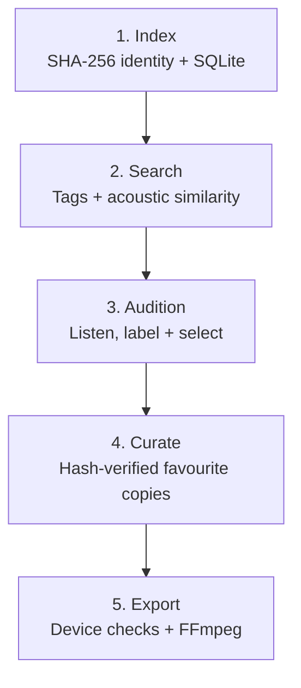

# Eidetic Sample Tools

**Find the sound. Build the collection. Play it.**

Turn the samples you already own into collections for your next track or live
set. Search beyond filenames, choose sounds by ear, and prepare validated
exports for Octatrack, Digitakt and TR-8S.

[Get started](docs/GETTING-STARTED.md) · [Workflows](docs/WORKFLOWS.md) ·
[Architecture](docs/TECHNOLOGY.md) · [Safety](docs/SAFETY.md)

## What you can do

- **Find a sound:** search musical tags and pack origins, or rank samples by
  acoustic similarity. Send the shortlist to an audition playlist.
- **Make an archive usable:** recover origins, inspect duplicates and plan
  reversible organisation while retaining the link to original audio.
- **Build a collection by ear:** record favourites and kit selections. Optional
  local AI suggests groups for listening; you decide what gets kept.
- **Prepare for hardware:** check device limits, generate compact filenames and
  convert WAV copies to the required sample rate and channel layout.
- **Inspect Ableton projects:** read tracks, devices and missing sample references
  from saved Sets without opening Live.

## How it works



- **Identity follows the file:** hashes connect locations, measurements and
  listening history. Exact copies and renames keep the same identity.
- **Search works without AI:** editable tag rules and measured attack, decay,
  spectrum and dynamics narrow the candidates.
- **AI is optional:** experimental local models can group a listening packet;
  a review page lets you check suggestions. Saved analysis can be reused.
- **Listening controls curation:** your labels approve favourites; promotion and
  export recheck the original bytes.

See the [architecture guide](docs/TECHNOLOGY.md) for algorithms and data formats.

## Start here

[Install the tools](docs/GETTING-STARTED.md), then inspect a sample folder:

```bash
sample-review --root /path/to/SAMPLES --no-probe --summary
```

This prints a summary without writing files or changing audio. Continue with the
[workflow guide](docs/WORKFLOWS.md) to search, audition and export.

| Package | Focus | Reference |
|---|---|---|
| `library-tools` | Inventory, search, analysis and curation | [Commands](library-tools/README.md) |
| `sample-tools` | Validated WAV export and card transfer | [Devices and formats](sample-tools/README.md) |
| `ableton-tools` | Read-only Live Set inspection | [Reports](ableton-tools/README.md) |

### Keep your library recoverable

- File moves preview by default, require `--apply` and retain undo records.
- Curation and export create copies. Read the [safety model](docs/SAFETY.md) before
  applying changes or syncing media.
- Onboard each Mac independently using the [lifecycle guide](docs/LIFECYCLE.md).
  An unavailable Mac's history can remain pending.
- The shared SSD carries the database, decisions and recovery records in
  `.eidetic/`; returning machines preserve older history without replacing newer work.

## Optional local AI

**Search first; classify a shortlist.** For a library of 22,000 samples or more,
use tags and acoustic search to narrow the work before running models.

- After the initial download, inference can run offline: no audio uploads or
  paid API calls.
- Models run one at a time and release their memory when finished.
- Saved analysis can be reused across listening packets.

| Resource | Observed in setup checks |
|---|---|
| Installation | About **2.2 GB** for the AI environment and both models |
| Peak memory | About **1.2 GiB** per model worker |
| First analysis | **18–37 seconds**, including startup |
| Reusing saved analysis | **Under 0.3 seconds** |

Measured with **one synthetic sound on an Apple Silicon Mac**. Larger packets
and different hardware will have different costs. The [AI setup guide](docs/AI-SETUP.md)
covers reproducible installation, resource controls and the full measurements.

## Development status

- **Established:** core review, organisation, conversion and Ableton inspection.
- **Beta:** search, curation and profile-based crates.
- **Experimental:** AI grouping and near-duplicate detection.
- **Still to validate:** broader library compatibility and hardware round trips.
- **Licence:** no software licence selected.

[Release notes](CHANGELOG.md) · [Development guide](docs/DEVELOPMENT.md) ·
[Roadmap](docs/ROADMAP.md) · [Decision records](decisions/)
