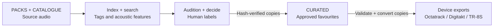

# Eidetic Sample Tools

**Turn a sample archive into a collection you can find, trust and play.**

Eidetic Sample Tools helps hardware-based electronic musicians find useful sounds
in large libraries, choose them by ear, and prepare them for Octatrack, Digitakt
and TR-8S. It connects the work between buying a sample pack and actually using
its sounds in a performance.

Three local Python packages bring together searchable inventory, acoustic
analysis, guided listening, device-specific export and Ableton project
inspection. The main interface is the command line, with an optional local
browser page for reviewing audio classification. It is a personal-first toolkit,
built around a working studio and being made more portable over time.

## Why use it

- **Find sounds by musical intent and measured sound.** Search by role, style,
  gear, character or pack origin; use an existing sample to rank acoustically
  similar candidates. Write a playlist to audition the results.
- **Make a large archive manageable.** Review its contents, recover pack
  provenance, plan role-based organisation and identify byte-identical copies.
  Search and analysis work without reorganising the audio first.
- **Build a collection that reflects your ears.** Audition packets, optional
  model-assisted grouping and recorded favourites turn a broad catalogue into a
  small trusted pool. Kit selections can also inform future search rankings.
- **Carry decisions across folder changes.** SHA-256 file identities link
  locations, measurements, tags and listening history to the same sample.
  Promotion and crate export check the bytes again before making copies.
- **Prepare for the instrument you will play.** Reviewed crates become named,
  validated WAV exports with the format, channel policy and folder layout for
  each supported device.
- **See what an Ableton project depends on.** Index Set structure and report
  present or missing sample references before considering library moves.

## What it does

| Package | Capabilities | Main commands |
|---|---|---|
| [Library tools](library-tools/README.md) | Inspect, organise, deduplicate, recover origin, tag, search, analyse and curate samples. | `sample-review`, `sample-tag`, `sample-find`, `sample-curate`, `sample-analyze` |
| [Sample export](sample-tools/README.md) | Resolve manifests or curated crates, validate device constraints, convert WAV copies and stage transfers. | `sample-export` |
| [Ableton tools](ableton-tools/README.md) | Read `.als` Sets for tempo, tracks, scenes, devices and sample dependencies. | `als-index`, `als-samples` |

## From archive to instrument

Keep source packs intact, make the broad catalogue searchable, then promote
favourites by ear. Device exports are rebuildable copies of that trusted pool.



The commands can be used independently. The complete
[workflow guide](docs/WORKFLOWS.md) joins inspection, reviewed organisation,
curation and export, including Ableton-reference checks before catalogue
migration.

## Technology at a glance

| Layer | Implementation | What it makes possible |
|---|---|---|
| Local tools | Python 3.12+, separate CLI packages | Use the parts needed for a session and inspect their outputs. |
| Sample identity and history | SHA-256 and SQLite | Keep one content identity across multiple paths; retain tags, features, reviews and promotions. |
| Search and audio analysis | TOML vocabulary rules, NumPy, SoundFile and FFmpeg fallback | Explainable tags and acoustic similarity over measured features. |
| Optional audio classification | Two revision-pinned CLAP models through PyTorch, Transformers and librosa | Suggest listening groups from audio, with cached embeddings and human review gates. |
| Local review page | Flask on `127.0.0.1` | Listen, resolve uncertain classifications, undo and resume a review. |
| Hardware preparation | TOML profiles, FFprobe and FFmpeg | Check crate constraints and create device-specific WAV copies. |
| Ableton inspection | Python standard-library gzip and XML parsing | Inspect saved Sets without running Live or editing the project. |

Audio processing and model inference run locally. The optional classification
workflow downloads its pinned model checkpoints on first use. Ordinary review,
search and export work with the core packages.

The [technology and architecture guide](docs/TECHNOLOGY.md) explains the data
model, search algorithms, model pipeline, package boundaries and extension points.

## Why it is safe

The library is more valuable than the software. The tools therefore favour
preview, evidence and recovery:

- Review and analysis commands do not change source audio.
- Commands that can move files default to a preview and require `--apply`.
- Move operations write manifests and undo records.
- Content hashes keep review history attached to the audio when paths change.
- Automated labels remain suggestions. Listening is the final approval step.
- Export writes converted copies; it does not convert source files in place.

Read the full [safety model](docs/SAFETY.md) before applying a move or syncing a
card.

## What works today

| Maturity | Capability |
|---|---|
| **Stable** | Review and index a library; plan reversible sorting, intake and exact de-duplication; convert approved samples for supported hardware; read-only Ableton Set indexing and sample-reference reporting. |
| **Beta** | Portable profiles; content-hash inventory; pack-origin recovery; tag and acoustic search; catalogue migration; human-gated curation; promotion integrity checks; profile-aware crate export and selected-crate card sync. |
| **Experimental** | Acoustic interpretation, audio-derived audition grouping, drum-role suggestions, benchmark tooling and conservative near-duplicate research. These produce evidence for listening and review. |
| **Planned** | MIDI generation, bounce analysis and stem separation. Specifications are kept in Git beside the working code. |

The maturity labels describe this project, not a public support guarantee. See
the [roadmap](docs/ROADMAP.md) for their exact meaning.

## Supported hardware

| Device | Export format | Transfer route |
|---|---|---|
| Octatrack MKII | 16-bit WAV, 44.1 kHz, source channel layout preserved | CompactFlash card |
| Digitakt MKI | 16-bit WAV, 48 kHz, mono | Elektron Transfer |
| TR-8S | 16-bit WAV, 48 kHz, mono by default; approved `stereo-essential` crate rows preserve stereo | SD card import |

Profiles live in [`profiles/devices/`](profiles/devices/). The current studio
profile is [`profiles/studios/eidetic-studio.toml`](profiles/studios/eidetic-studio.toml).

## Try a safe first run

After installing the library tools, point the review command at a sample
directory:

```bash
sample-review --root /path/to/SAMPLES --no-probe --summary
```

Replace `/path/to/SAMPLES` with your library. This reads filenames and prints a
summary. It does not move, rename, convert or delete audio.

Follow the [getting started guide](docs/GETTING-STARTED.md) for prerequisites,
installation and a first TSV index. Once the search index is built, turn a query
into an audition playlist:

```bash
sample-find perc tribal analog --root /path/to/SAMPLES --limit 20 \
  --m3u8 manifests/percussion.m3u8
```

Search results are candidates for listening. For an exportable crate, first
promote approved favourites into `CURATED/`, then use `sample-find --curated-only`.

## Documentation

- [Getting started](docs/GETTING-STARTED.md) — install and run a safe review.
- [Technology and architecture](docs/TECHNOLOGY.md) — how the capabilities work and where they live in the code.
- [Workflows](docs/WORKFLOWS.md) — inspect, organise, curate and export.
- [Safety model](docs/SAFETY.md) — understand previews, apply steps and recovery.
- [Library command reference](library-tools/README.md) — every library command.
- [Sample export reference](sample-tools/README.md) — conversion and device transfer.
- [Ableton tools reference](ableton-tools/README.md) — read-only Set and sample-reference inspection.
- [Roadmap](docs/ROADMAP.md) — personal priorities and the path towards a product.

## Research and beta work

Research stays in plain sight:

- [`STATUS.md`](STATUS.md) records the current operational position.
- [`decisions/`](decisions/) records approaches that were adopted, rejected or
  downgraded.
- [`docs/superpowers/specs/`](docs/superpowers/specs/) contains design and audit
  documents.
- [`docs/superpowers/plans/`](docs/superpowers/plans/) contains implementation
  plans.

Failed experiments remain useful evidence. In particular, the older CNN-LSTM
drum-role classifier is review-only after its first ear calibration failed. The
separate CLAP packet workflow also requires completed human review and a passing
benchmark before publishing grouped playlists; passing that gate does not approve
a sample for promotion.

## Project status

The repository contains working tools and tested workflows. End-to-end hardware
export and card sync remain untested against the live library in the dated
[project status](STATUS.md), which also records its backup and integrity risks,
unmerged organisation work and immediate operational constraints. Software
capability and the readiness of that particular library are separate questions.

This is an actively developed personal toolkit. Installation, configuration and
validation on other libraries still need work; see the [roadmap](docs/ROADMAP.md)
for the path towards broader use.

## Licence

No software licence has been selected. The source is visible for personal
development and review; visibility alone does not grant permission to copy,
modify or redistribute it.
