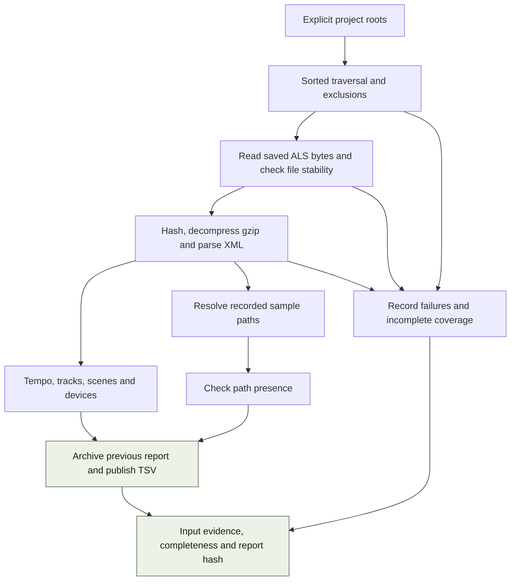

# Ableton report architecture

`ableton-tools` scans saved `.als` files and publishes project and sample-reference
tables with evidence about the scan. It uses Python's standard library and does
not start Live, edit Sets or connect to the sample-library database.

[Package overview](README.md) · [Commands](REFERENCE.md) ·
[System overview](../docs/TECHNOLOGY.md) · [Shared contracts](../docs/STATE-AND-CONTRACTS.md)

## Report pipeline

The two commands run separate scans. They share implementation, but do not
share a persistent parsed-Set cache or a single cross-report snapshot.

## Module map

| Module | Responsibility |
|---|---|
| [cli.py](src/abletontools/cli.py) | Select roots/output, collect report rows and print results/errors. |
| [reports.py](src/abletontools/reports.py) | `ReportRun`: traversal, input evidence, parsing, completeness, locking and publication. |
| [index.py](src/abletontools/index.py) | Extract Set summary fields and serialise overview rows. |
| [samples.py](src/abletontools/samples.py) | Extract `SampleRef` paths, resolve them and classify presence. |
| [read.py](src/abletontools/read.py) | Basic reader/traversal helpers; the report CLI uses `ReportRun` for evidence and lifecycle handling. |

## Inputs and traversal

An explicit `--root` overrides `ALS_ROOTS`; one must be provided. The output
directory is always explicit. Roots are resolved and checked before traversal.
Overlapping roots deduplicate already visited Set paths.

Traversal is sorted. Hidden entries and `Backup` directories are excluded;
directory symlinks are not followed and are recorded as incomplete coverage.
Unavailable roots and traversal/read/parse failures are retained in report
metadata rather than treated as successful empty scans.

Each Set is read as compressed bytes, with file metadata observed before and
after. A change during reading rejects that observation. The recorded SHA-256
identifies the exact compressed payload that is then decompressed and parsed.
This binds parser output to observed bytes; it does not prevent a later save in
Live from changing the file after the scan.

## Extracted fields and their limits

The overview extracts `Tempo/Manual`, named audio and MIDI tracks, scenes and
device tags from the XML. Missing tempo remains empty. Track count follows the
named tracks extracted by the current reader; it is not a count of every possible
Live track type. Device entries describe saved XML structure, not whether a
plug-in is installed or will load successfully.

Sample extraction reads `SampleRef/FileRef` path fields. An existing absolute
path is preferred; the reader can use the recorded relative path against the
Set directory. The report labels references present or missing using filesystem
existence. It does not hash/decode referenced audio, repair paths, inspect an
unsaved session or establish a universal dependency graph for every Live device.

An incomplete report cannot prove that a sample has no project dependencies.
Even a complete report is complete relative to the chosen roots, exclusions and
supported extraction behaviour.

## Outputs and publication

| Output | Contract |
|---|---|
| `als-index.tsv` | `path`, `tempo`, `track_count`, `tracks`, `scene_count`, `devices`, `mtime`. |
| `als-samples.tsv` | `set_path`, `sample_path`, `status`. |
| `<report>.tsv.metadata.json` | `eidetic-ableton-report`, version 1; run identity, roots, inputs, errors, exclusions, completeness, report hash and row count. |
| `.history/<report-stem>/<run-id>/` | Previous report files retained when publishing a replacement. |

Each report has its own non-blocking writer lock. Publication archives the old
pair and writes the new TSV and sidecar through separate temporary-file
replacements. Each replacement is atomic; the pair is not one transaction.
Consumers can check the report hash to detect mismatched files after interruption.

Input failures mark `complete: false` and produce stderr messages, but the CLI
still returns zero after successfully publishing a partial report. Publication
failures return a non-zero status. Automation must inspect completeness and the
report hash instead of interpreting exit status alone as complete coverage.

## Performance and failure boundaries

Each command walks and parses the chosen Sets again. Runtime grows with Set
count, compressed/XML sizes and sample-path checks, particularly on an external
or unavailable drive. The current reader holds one Set's compressed payload and
decompressed XML in memory, and the CLI accumulates report rows before writing.
There is no streaming XML pipeline or incremental report cache.

Source parsing is read-only, while reports and their history consume output
space. Repeated publication preserves prior files and therefore needs a retention
policy for long-lived archives. A sample-library backup only includes these
reports if their chosen output directory is inside the backed-up state tree.

## Verification map

Reader, index and sample tests cover XML fields and reference resolution.
Report-lifecycle tests cover missing roots, malformed Sets, changed inputs,
history retention and metadata. CLI and installed-package checks exercise command
entry points independently of the checkout. See the
[development guide](../docs/DEVELOPMENT.md) for execution.
