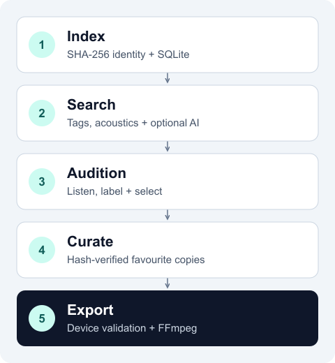

# Technology and architecture

The toolkit treats discovery, listening and export as a traceable data pipeline.
File identity connects the stages; inspectable outputs let each command work
independently.

## Three packages, explicit boundaries

| Package | Responsibility | Stack |
|---|---|---|
| [`library-tools`](../library-tools/README.md) | Inventory, provenance, search, analysis and curation | Python 3.12+, SQLite, NumPy, SoundFile; optional PyTorch and Flask |
| [`sample-tools`](../sample-tools/README.md) | Resolve crates, validate constraints, convert and stage audio | Python 3.12+, FFmpeg and FFprobe |
| [`ableton-tools`](../ableton-tools/README.md) | Inspect saved Sets and resolve sample references | Python 3.12+ standard-library gzip and XML parsing |

CLI entry points are declared in each package's `pyproject.toml`. Commands
exchange SQLite data, TSV manifests and labels, JSON review state and M3U8
playlists. The exporter consumes a crate without requiring the `library-tools`
package or a database; when portable library state is present, it validates that
state before writes and joins the same writer protocol. TOML files hold tag
vocabulary, collection targets and device configuration.

## Portable state and upgrades

Release 0.2 binds the database to a portable library UUID under `SAMPLES/.eidetic/`.
Machine onboarding separates usable current state from incomplete historical
coverage. One Mac can start without the other. Later local databases and human
files are captured with content fingerprints in state-relative archives; active
SSD decisions are preserved and unresolved history remains visible in diagnostics.
The shared SSD holds the active database and `.eidetic/runs/` evidence; Python
environments and model installations remain local to each Mac. Captured secondary
history is retained for reconciliation and never silently merged into active approval.
Schema 5 adds staged scans, feature versions, tag provenance, and decision/event
history. Historical schemas require explicit validated migrations with verified
backups; ordinary database opening cannot upgrade or relabel older state.
Single-writer locks and durable operation journals coordinate filesystem and
SQLite changes. Classifier subprocesses inherit the held lock while updating the
embedding cache; review sessions retain it until the server exits. Read-only diagnostics use settled evidence without creating
sidecars. See the [lifecycle guide](LIFECYCLE.md) for adoption and recovery.

## Identity survives a folder change

The [inventory](../library-tools/src/librarytools/inventory.py) separates an asset
from its locations. `sample_id` is the SHA-256 hash of the file bytes; locations
record paths, library zones and scans. An exact copy shares its identity, while
re-encoding or changing embedded metadata creates a new one.

SQLite links that identity to provenance, acoustic features, tags, reviews,
promotions and kit picks. Measurements can be reused across paths, and listening
history stays attached to the same bytes. Search prefers curated locations when
collapsing exact copies and preserves canonical roles and approved descriptions
in crates; promotion and undo update those locations immediately. Newly generated
search crates record whether each exact curated copy has an active promotion and
a recorded favourite. Missing approval evidence is marked as requiring review,
even when the file was already in `CURATED/` before onboarding.
Promotion preflights its full selection, and promotion and crate export recheck
the bytes before copying or converting. A matching hash establishes byte identity;
perceptual similarity is a separate search problem.

## Search by intent or by sound

[Origin recovery](../library-tools/src/librarytools/origin.py) combines surviving
pack folders, recognised filename tokens and identical copies with known origins.
[`vocabulary.toml`](../library-tools/vocabulary.toml) then maps that evidence,
names and acoustic measurements to role, style, gear and character tags.
Editing a rule can retag the library without modifying audio.

`sample-find` combines search terms with AND, or OR with `--any`. Default results
spread across filename-derived sound families to reduce repeated variants.
`--kit-id` records selections; `--preferred` ranks by those picks.

For `--like`, [feature extraction](../library-tools/src/librarytools/audiofeatures.py)
decodes with SoundFile and an FFmpeg fallback, then measures:

- **Envelope:** attack, tail, duration and leading/trailing silence.
- **Dynamics:** peak, RMS and crest factor.
- **Spectrum and rhythm:** centroid, flatness, band energy, zero-crossing rate
  and onset density.

[Similarity ranking](../library-tools/src/librarytools/find.py) uses min-max
normalised Euclidean distance over measurements shared with the reference.
This gives an inspectable acoustic comparison without a learned embedding model.
Results can become playlists or, after promotion, export crates.

## Optional local AI for listening packets

The packet classifier separates **form** from **content**. Acoustic rules use
onsets, periodicity, duration and beat evidence to distinguish one-shots, loops
and longer sources. Two CLAP audio-language models compare audio embeddings with
content prompts. Filename text has zero decision weight in this ensemble.

The current nine groups cover percussion, drum loops and vocal material, plus
out-of-brief audio. This remains an experimental, focused listening assistant.

### Model execution and caching

[Model adapters](../library-tools/src/librarytools/classification/models.py) pin
`laion/clap-htsat-unfused` and `laion/larger_clap_music_and_speech` to explicit
revisions. PyTorch and Transformers run on the CPU; librosa loads 48 kHz mono
excerpts from bounded positions in longer files.

Models run sequentially in short-lived workers to release memory between runs.
SQLite caches audio embeddings by sample identity, model, revision and excerpt
policy. Prompt embeddings have separate policy keys, so prompt changes can reuse
audio embeddings. Checkpoints download on first use; audio processing and
inference run locally.

### Review controls publication

Disagreements, weak scores and acoustic boundary cases enter a review queue.
Each accepted group contributes a blind sentinel; a failed sentinel opens the
rest of that group for review.

A [Flask interface](../library-tools/src/librarytools/classification/review_server.py)
on `127.0.0.1` provides playback, decisions, notes, undo and resume. Atomic JSON
state ties decisions to a classification digest. Grouped playlists publish only
after review completes and a 24-row benchmark passes: at least **22 form** and
**19 joint content/group** matches. These are packet acceptance thresholds, not
general accuracy claims. Changed decisions withdraw stale publications.

Musical approval is recorded separately in `labels.tsv`. Only validated
favourites with a canonical role and descriptor can be promoted. Collection
roles and quota parsing live in [curation policy](../library-tools/src/librarytools/curation_policy.py),
so a small kit can use its own targets without changing hardware profiles.

## Hardware export as a build step

A crate records `sample_id`, `source_path`, `role`, `descriptor` and `reason`.
Generated crates add a versioned metadata sidecar bound to the TSV hash. Export
rejects explicit review-required metadata; legacy standalone five-column crates
remain compatible as separately reviewed inputs.
The [planner](../sample-tools/src/sampletools/export.py) verifies current hashes,
paths inside `CURATED/`, accepted roles, compact names and device-specific count
or duration limits from the resolved device configuration. Legacy path/glob
manifests use a separate planning path.

FFprobe reads media properties. FFmpeg writes PCM WAV copies to temporary files,
renaming them after successful conversion. Existing outputs are reused only when
their source, settings, runtime and output hashes match a versioned receipt;
rebuilding stale outputs requires `--force`. With `--crate`, card sync copies only
that crate's planned files, including existing staged conversions. Digitakt uses Elektron Transfer;
Octatrack and TR-8S support mounted-media copying.

The [export reference](../sample-tools/README.md) documents formats and limits.
Playback, assignment and save/reload still need an
[instrument test](WORKFLOWS.md#first-device-smoke-test).

## Saved Ableton Sets as structured data

The [reader](../ableton-tools/src/abletontools/read.py) parses gzip-compressed XML
to report tempo, tracks, scenes, devices and sample references without running
Live. It never edits Sets or relinks media. Catalogue migration also has a
conservative preflight for saved Sets containing `CURATED` references; it is not
a complete dependency analysis. Report metadata records input hashes, roots,
failures and completeness; regeneration archives earlier reports under `.history/`.
A missing root or failed parse leaves an incomplete observation, so it cannot
establish that a sample has no project dependencies.

See [repository conventions](../AGENTS.md) for verification commands and the
[roadmap](ROADMAP.md) for extension priorities.
