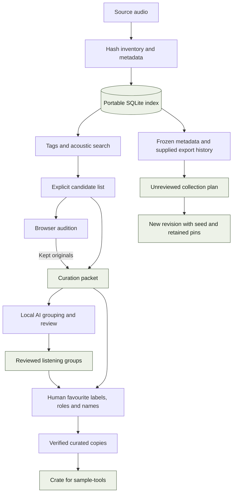

# Library architecture

`library-tools` owns the path from source discovery to an approved curated copy.
It also provides a separate metadata planner for reproducible candidate sets.
This guide describes the implemented system; planned integrations are identified
explicitly.

[Package overview](README.md) · [Commands](REFERENCE.md) ·
[System boundaries](../docs/TECHNOLOGY.md) · [Shared state](../docs/STATE-AND-CONTRACTS.md)

## Data flow

The two branches stop at different boundaries. Search and explicit candidates
can feed listening and curation today. Collection plans do not yet have an
automatic browser handoff; a pin retains membership without approving a sample.

## Module map

| Area | Main modules | Responsibility |
|---|---|---|
| Inventory and state | [inventory.py](src/librarytools/inventory.py), [schema.py](src/librarytools/schema.py), [state.py](src/librarytools/state.py) | Content identities, scan publication, database validation and library binding. |
| Discovery | [origin.py](src/librarytools/origin.py), [tagging.py](src/librarytools/tagging.py), [find.py](src/librarytools/find.py) | Provenance, tags, filtering, acoustic similarity and playlists/crates. |
| Measurements | [audiofeatures.py](src/librarytools/audiofeatures.py), [features.py](src/librarytools/features.py) | Decode audio, compute measurements and retain extraction provenance. |
| Collection planning | [collection_snapshot.py](src/librarytools/collection_snapshot.py), [collection_history.py](src/librarytools/collection_history.py), [collection_plan.py](src/librarytools/collection_plan.py) | Freeze candidates, interpret explicit history and generate validated revisions. |
| Audition | [vibe_session.py](src/librarytools/vibe_session.py), [vibe_shortlist.py](src/librarytools/vibe_shortlist.py), [vibe_server.py](src/librarytools/vibe_server.py) | Verified playback, saved Keep/Skip choices and curation handoff. |
| Classification | [packet_classifier.py](src/librarytools/packet_classifier.py), [classification/](src/librarytools/classification/) | Acoustic form, local model votes, caching, review and grouped playlists. |
| Curation | [curate.py](src/librarytools/curate.py), [curation_policy.py](src/librarytools/curation_policy.py), [promotion_health.py](src/librarytools/promotion_health.py) | Validate favourite labels, copy approved bytes and track promotion health. |
| Lifecycle | [locking.py](src/librarytools/locking.py), [operations.py](src/librarytools/operations.py), [onboarding.py](src/librarytools/onboarding.py), [lifecycle.py](src/librarytools/lifecycle.py) | Writer coordination, recovery, historical capture, backups and upgrades. |

CLI modules translate arguments into these operations. Bundled profiles,
vocabulary and browser resources make the installed wheel independent of the
checkout's working directory.

## Inventory and database model

The schema separates an asset from its locations. `assets.sample_id` is the hash
of the entire file; `locations` records relative paths, zones and observations.
Exact duplicates therefore share features and identity even when several paths
exist. Hash-cache entries use device, inode, size and modification time to reuse
unchanged-file observations.

Schema 5 groups state by purpose:

| Tables | Meaning |
|---|---|
| `library_identity`, `scans`, `scan_observations`, `locations`, `assets` | Library binding and observed file presence. |
| `asset_features`, `annotations`, `origins`, `tags` | Measurements and interpreted metadata, including extractor and tag provenance. |
| `reviews`, `picks`, `promotions` | Current decisions and curated-copy status. |
| `review_events`, `pick_events`, `promotion_events` | Retained decision and promotion history. |
| `audio_embeddings`, `prompt_embeddings` | Model/revision/policy-specific reusable vectors. |

A scan begins as incomplete and stages observations without replacing current
locations. Completion verifies the traversal count and observed file metadata,
then publishes locations and scan status in one SQLite transaction. Missing
curated copies remain visible as promotion discrepancies. A failed scan cannot
turn an unavailable drive into a successful empty inventory.

Opening the database validates its known shape, declared version, integrity and
foreign keys. Upgrades are explicit; see [state lifecycle](../docs/STATE-AND-CONTRACTS.md).

## Search is distinct from collection planning

`sample-find` loads indexed identities, collapses exact copies and prefers
curated locations. Terms combine with AND by default or OR with `--any`.
Vocabulary rules derive role, style, gear and character tags from origins,
names and measurements. Origin recovery uses surviving pack paths, recognised
tokens and byte-identical copies with known provenance.

Acoustic `--like` search uses min-max normalised Euclidean distance across
measurements shared with the reference: envelope, duration, silence, dynamics,
spectral properties and onset density. It does not use a learned embedding.
Default search results spread across filename-derived families; recorded kit
picks can influence the separate preferred-results mode.

The collection planner shares metadata matching but uses its own ordering:

1. Capture a complete indexed population under a guarded read-only inspection.
   A candidate can match any current alias; all its aliases remain in the snapshot.
2. Load explicitly supplied, device-scoped export history using original sample
   IDs. Unknown coverage stays unknown.
3. Apply `exclude`, `prefer-new` or `allow`. The first two require supplied history.
4. Retain pins, then order eligible IDs using a hash of seed and sample ID.
   `prefer-new` places IDs absent from supplied history ahead of recorded exports.
5. Take the requested count and report any shortage. Excluded items are not
   silently reintroduced to fill the request.
6. Write a new self-contained revision with JSON and a human-readable review.

The policy is `metadata-filter-seeded-v1`. Brief text is recorded context, not
interpreted by a model. Family spreading from ordinary search, BPM suitability,
musical quotas and total device-space constraints are not part of this planner.

`collection_id` identifies the frozen population, history and fixed policy.
`plan_id` hashes the revision content, excluding its creation time.
`parent_plan_id` connects revisions. Loading verifies the digest and reconstructs
the canonical choices. Regeneration changes count, seed or pins against the
same snapshot; inherited pins remain, and each chosen decision is `unreviewed`.
See the [planner guide](../docs/COLLECTION-PLANNER.md) for the exact commands.

## Local AI and review

The packet classifier separates acoustic **form** from semantic **content**.
Onset, periodicity, duration and beat evidence distinguish one-shots, loops and
longer material. Two pinned CLAP models compare audio with text prompts for
content groups. The ensemble gives filenames zero decision weight. Its nine
listening groups cover the current percussion/vocal brief and out-of-brief material.

The [model specifications](src/librarytools/classification/models.py) pin
`laion/clap-htsat-unfused` and `laion/larger_clap_music_and_speech` to explicit
revisions. Production inference runs sequentially in short-lived CPU subprocesses
so one model's memory can be released before the next loads. Audio excerpts are
bounded, decoded to 48 kHz mono; the excerpt policy is part of cache identity.

Audio cache keys are `(sample_id, model_id, model_revision, excerpt_policy)`.
Prompt keys also include prompt policy and label, allowing prompt changes to
reuse audio vectors. The [cache](src/librarytools/classification/cache.py) stores
float16 vectors, validates dimensions and finite values when reading, and commits
each completed inference batch. A worker timeout preserves completed batches.

Current defaults are two threads, two files per batch and 300 seconds per whole
model worker. The timeout is not a per-file budget. Checkpoint downloads and the
machine's Python/model installation are separate from local inference.

Review is an explicit gate before publishing grouped playlists:

- Disagreements, weak scores and acoustic boundary cases enter a review queue.
- Blind sentinel examples check accepted groups. A failed sentinel expands review
  to the remaining group members.
- Decisions are bound to a classification digest; edits invalidate stale published
  outputs. Review can resume with its recorded state.
- Publication requires completed review and a 24-row benchmark with at least 22
  correct form and 19 correct joint content/group results. These are acceptance
  thresholds for that packet, not general model accuracy.

This review validates grouping. Musical favourite approval still comes from
curation labels. Whole-library retrieval from a free-text musical brief remains
an integration to build, not an existing CLAP search endpoint.

## Browser audition and approval

The chooser serves prepared candidates on `127.0.0.1` using Flask and bundled
HTML/CSS/JavaScript. Writes require its per-server token. Audio routes accept
registered source IDs and check the original and prepared preview hashes.
The source chooser loads independently of the optional vocal-rendering experiment.

`shortlist.json` stores Keep/Skip decisions by identity under a session-local
writer lock. Keep verifies the original; reset removes a decision. A playlist
points to verified originals, not the browser's converted previews. Creating a
curation packet additionally requires a bound index and complete scan, and checks
the kept identities and paths again.

The resulting packet still needs explicit favourite labels, canonical roles and
descriptors. Promotion preflights the selection and copies approved bytes into
`CURATED/`, recording reviews and promotions. Search-generated crates require
current favourite and active-promotion evidence for the specific curated copy.
Existing curated folders alone do not supply that approval.

## Recovery and performance boundaries

Library mutations share the library writer lock. Moves and promotions retain
per-item journals because filesystem publication and SQLite updates are separate
steps. Recovery checks bytes and recorded state before continuing. Classification
review holds the library lock for the server's lifetime, so a long review session
can block other library writes. See [interruption handling](../docs/STATE-AND-CONTRACTS.md#interruption-and-recovery).

| Scaling pressure | Current behaviour and consequence |
|---|---|
| Many source files | Inventory hashes and acoustic decoding read audio; cached observations and features reduce repeated work. |
| Large metadata population | Planning materialises candidates and aliases, sorts eligible IDs and validates full snapshots; memory grows with the population. |
| Many plan revisions | Each stores the matching population again. Snapshot storage grows with population size and revision count. Plans are capped at 128 MiB; each history file at 32 MiB. |
| Cold models | Model loading, decoding and new embeddings dominate. Cached embeddings avoid inference but do not eliminate acoustic checks or human review. |
| Large audition | The current session format allows up to 12 groove and 12 vocal inputs, each at most 120 seconds. It is not a whole-library browser. |
| Long-term state | Embeddings, decision histories and run artifacts accumulate. Backups and maintenance need to preserve human evidence separately from derived data. |

The [measured trial](../docs/SET-GENERATION-TRIAL.md) and
[synthetic planner benchmark](../docs/DEVELOPMENT.md#compare-collection-planner-performance)
measure different parts of the system. Neither establishes musical quality for a
full-library AI selection or the capacity of a hardware browsing collection.

## Verification map

Inventory, lifecycle and operation tests cover complete-scan publication, identity,
migrations, locking and recovery. Collection tests cover snapshot validity,
history coverage, determinism, shortages, pins and offline regeneration. Audition,
classification and curation tests cover state validation and approval boundaries.
Installed-package checks exercise the resources and CLI handoffs from wheels.
Use the [development guide](../docs/DEVELOPMENT.md) to run the relevant checks.
