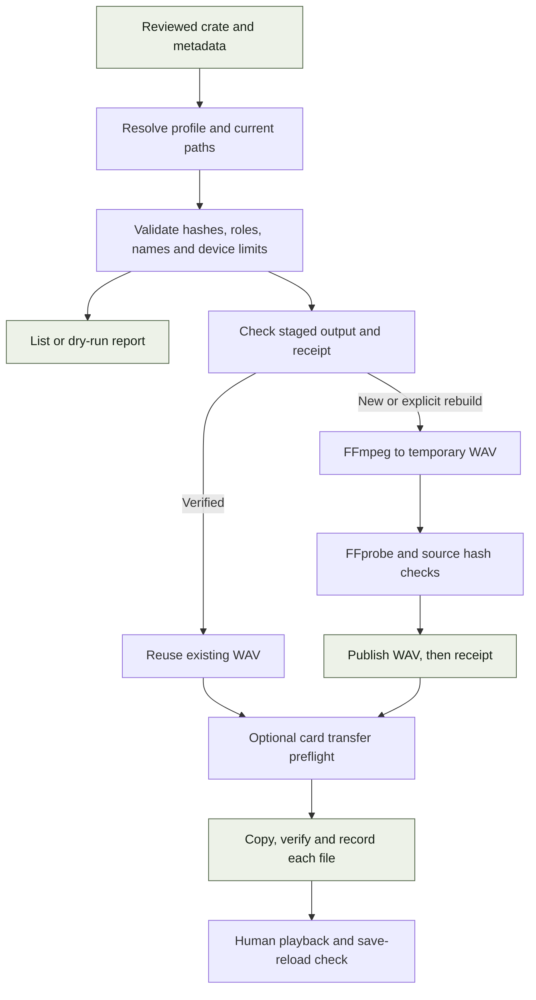

# Export architecture

`sample-tools` turns a reviewed selection into verified, device-formatted copies.
It is independently installable and does not import `library-tools`.

[Package overview](README.md) · [Commands and formats](REFERENCE.md) ·
[System overview](../docs/TECHNOLOGY.md) · [Shared contracts](../docs/STATE-AND-CONTRACTS.md)

## Execution path

List and dry-run modes stop before writing audio. Normal export writes copies;
there is no `--apply` gate. A card transfer is an additional explicit destination.
The existing [safety rules](../docs/SAFETY.md) govern these commands.

## Module map

| Module | Responsibility |
|---|---|
| [cli.py](src/sampletools/cli.py) | Arguments, profile selection, preview/export and optional transfer orchestration. |
| [config.py](src/sampletools/config.py) | Device specifications, bundled profiles and path configuration. |
| [export.py](src/sampletools/export.py) | Crate and legacy plans, source validation, reuse, conversion publication and card sync. |
| [convert.py](src/sampletools/convert.py), [probe.py](src/sampletools/probe.py) | FFmpeg conversion and FFprobe media properties. |
| [receipts.py](src/sampletools/receipts.py) | Versioned source/settings/runtime/output evidence and reuse checks. |
| [export_state.py](src/sampletools/export_state.py) | Independent implementation of the shared-library writer protocol. |

## Input contracts

The normal curation handoff is a TSV with `sample_id`, `source_path`, `role`,
`descriptor` and `reason`. `sample_id` is the original source SHA-256, not the
converted WAV hash. Relative source paths resolve against the selected sample
root. The [crate reference](REFERENCE.md#crate-format) defines accepted roles.

Generated crates add `.tsv.metadata.json` with format `eidetic-crate`, version 1.
When supplied, the TSV digest must match and approval metadata must describe
approved rows with the matching ordered identities and paths. Review-required
metadata is refused. Legacy five-column crates without this sidecar remain
accepted as separately reviewed inputs; the exporter does not query a curation
database to independently prove every human decision.

`build_crate_plan` resolves the entire selection before conversion. It checks
source existence, containment within `CURATED/`, source hashes, accepted roles,
name collisions and configured count/duration limits. Long-form roles are
rejected for Digitakt and TR-8S. Configuration is an export policy, not a live
query of an attached device's free space or memory.

Legacy path/glob manifests use a separate `build_plan` path. They do not acquire
all the curation evidence of generated crates. Keep their compatibility use
distinct from the approved-crate workflow when extending the exporter.

## Names, layouts and configuration

Crate filenames combine a role code, per-role ordinal, shortened descriptor and
source-hash prefix. Their order is significant: reordering a crate can change
names and therefore the destination paths used for reuse.

| Device | Layout within its staging directory |
|---|---|
| Octatrack | `EIDETIC-CURATED/AUDIO/<crate>/<role>/<name>.wav` |
| Digitakt | `<crate>/<role>/<name>.wav` |
| TR-8S | `ROLAND/TR-8S/SAMPLE/<crate>/<name>.wav` |

Rates, bit depths and channel policies are listed in the
[format reference](REFERENCE.md#output-formats). TR-8S crate rows marked
`stereo-essential` preserve source channels; otherwise its default is mono.

An explicit sample root selects that library and its default `_EXPORT/` staging
tree. An explicit export root overrides staging. Environment-based paths remain
supported; their precedence and profile selection are in
[configuration](REFERENCE.md#install-and-configure).

## Conversion and reuse

The exporter hashes each current source and compares any staged output with
its adjacent receipt. Reuse depends on source identity, device conversion
settings, tool version, FFmpeg version and output hash.

| Status | Meaning | Export behaviour |
|---|---|---|
| `new` | No staged output exists. | Convert. |
| `verified` | Source, settings, runtime and output bytes match. | Reuse unless explicitly rebuilding. |
| `stale` | Source, settings or runtime differs. | Refuse without `--force`. |
| `damaged` | Output bytes differ from the receipt. | Refuse without `--force`. |
| `unverified` | Output lacks usable verification evidence. | Refuse without `--force`. |

Blocked statuses are checked for the selection before conversion begins.
For each item, FFmpeg writes a temporary WAV in the destination directory.
The exporter rehashes the source and probes the result to verify sample rate,
bit depth, expected channels, supported mono/stereo and positive duration.
It then creates receipt evidence, flushes the WAV, renames it into place and
publishes the receipt separately.

The receipt records `source_sha256`, `output_sha256`, output size, conversion
settings, runtime versions and library UUID when available. Software validation
is recorded as passed; hardware verification remains unverified.

WAV and receipt publication are separate operations. A crash between them leaves
an unverified output, not a reusable success. Rebuilding creates derived copies
without modifying the original source.

## Card transfer and interrupted copies

Crate-based sync selects only that crate's planned outputs. It preflights every
staged file and destination, rejects path escapes and invalid destinations, and
verifies conversion evidence before writing to the card. The legacy unscoped
path instead considers the device's staged WAVs.

A new `eidetic-transfer` journal under `.eidetic/transfers/` records the device,
destination root, selected output hashes and pending items. Each item advances
through copying to verified. A changed or missing destination is written through
a temporary file, checked against its staged source, flushed, renamed and read
back for a final hash check. Matching destination bytes can be reused.

On a handled interruption the journal records `interrupted`; a process crash can
leave its last in-progress state. Already completed files remain. Rerunning
creates a new transfer record and can skip matching bytes; there is no atomic
rollback of a whole collection. The journal records copied content, not current
card inventory or successful playback.

Digitakt loading remains a separate Elektron Transfer step. Octatrack and TR-8S
mounted-card copies still need the [instrument check](../docs/WORKFLOWS.md#first-device-smoke-test).

## Shared state and scale

`export_state` checks available identity/schema/adoption/operation evidence and
joins `.eidetic/writer.lock` without depending on the library package. It refuses
incompatible or unfinished state rather than migrating it. A standalone reviewed
crate can still be exported without a library database.

Hash verification deliberately adds reads, even when conversion is reused.
Source duration and channel count drive conversion work and output bytes; a file
count alone is not a useful estimate of disk use. Export currently processes
items sequentially and holds the library writer lock during the operation.

Each card-copy transition rewrites the full transfer JSON. For a collection of
`n` files this creates roughly quadratic total journal-serialization work, in
addition to audio I/O. Current validation covers configured per-crate limits;
there is no aggregate free-space reserve, device-wide capacity allocator or
incremental append-only transfer log. Larger-set work should assess these costs
before increasing collection sizes substantially.

## Verification map

The export lifecycle tests cover receipt reuse, stale/damaged outputs, state
compatibility and copy boundaries. Profile and foundation tests cover roles,
layouts, configured formats and the curation handoff. Machine-path tests cover
explicit roots and mount changes. Installed-wheel smoke checks exercise conversion
and bundled resources outside the checkout.

Run them using the [development guide](../docs/DEVELOPMENT.md). Software checks
and stored transfer evidence remain separate from listening on an instrument.
